# NovaOS Ecosystem 🚀

> **HELICORP | VÒNG 2 – THIẾT KẾ LANDING PAGE**  
> Landing page giới thiệu hệ sinh thái thiết bị thông minh NovaOS, xây dựng bằng Next.js App Router.

[](https://vercel.com)
[](https://nextjs.org)
[](https://typescriptlang.org)
[](https://tailwindcss.com)

---

## 🎯 Tính năng nổi bật
### 📊 Analytics Tracking & Webhook
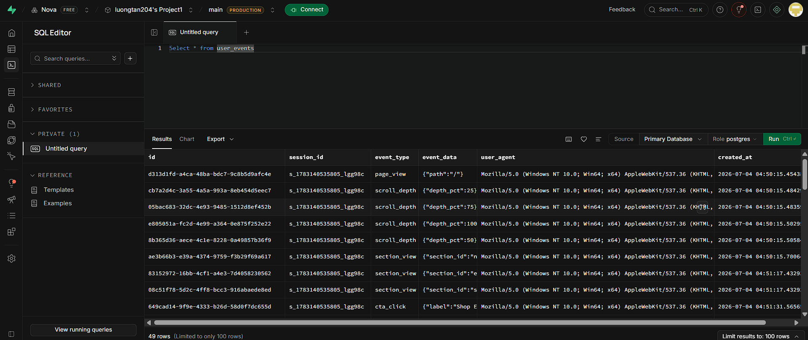
- **Scroll depth** — milestone 25/50/75/100% + toast notification
- **Section view** — IntersectionObserver theo dõi từng section
- **CTA click** — event delegation theo dõi các nút quan trọng
- Lưu toàn bộ vào Supabase `user_events` table
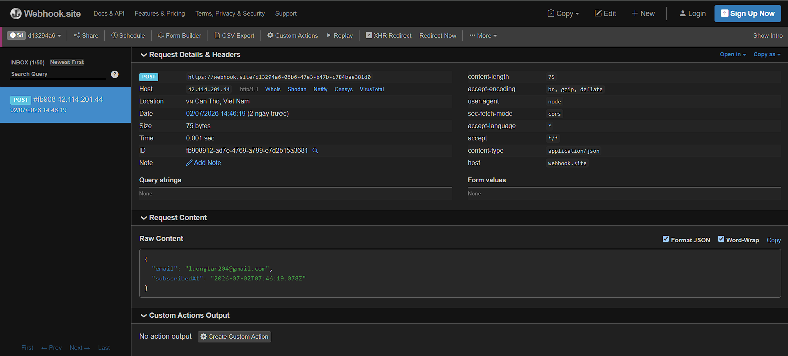
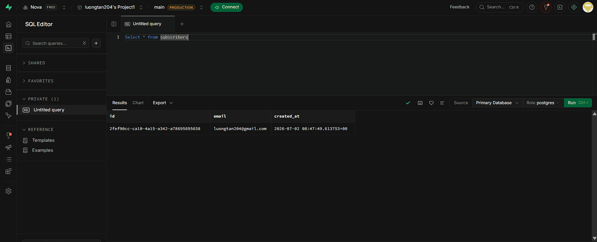
- **Webhook Form** — Lưu đăng ký Waitlist vào bảng `subscribers` và gửi về webhook

### 🗄️ Tích hợp Backend
  - Database: **Supabase (PostgreSQL)**
  - API Routes: `app/api/events/route.ts` & `app/api/subscribe/route.ts`
  - Client Utilities: `lib/analytics.ts`
  - Cấu hình & SQL: `utils/supabase/` & `supabase/migrations/create_user_events.sql`

### 🌙 Dark Mode & Animation
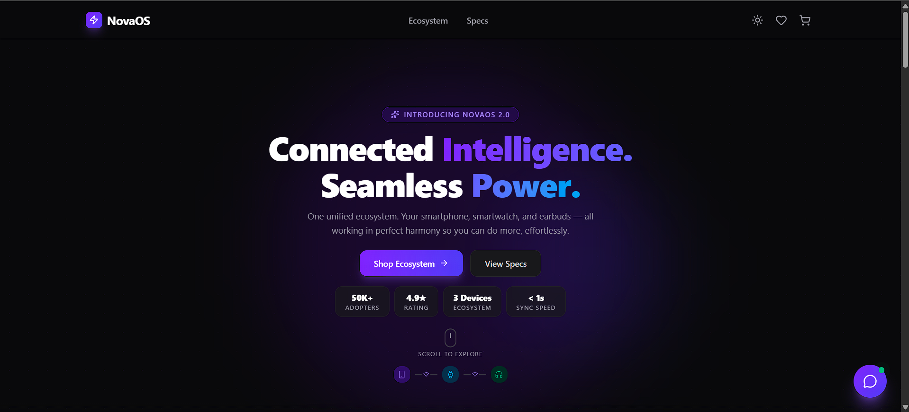
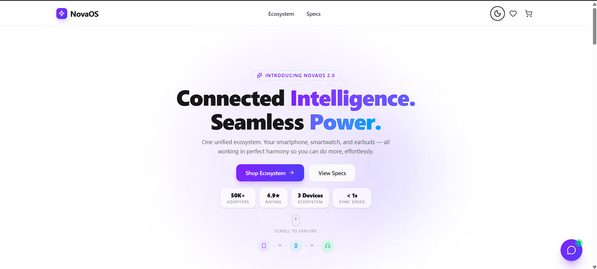
- Hệ thống theme `next-themes` — tự detect OS preference
- Toggle button ở Header, transition mượt

### ✨ Nâng cao hiệu ứng
  - **Skeleton Loading:** `components/SkeletonCard.tsx` (tạo hiệu ứng tải khung xương `animate-pulse` trước khi hiển thị sản phẩm)
  - **Micro-interactions:** Sử dụng Framer Motion `whileHover`, `whileTap` tạo cảm giác tương tác vật lý (nhấn lún, phóng to) ở `ProductGrid.tsx`, `CartDrawer.tsx` và các nút CTA.

### 🎬 Hero + Scrollytelling
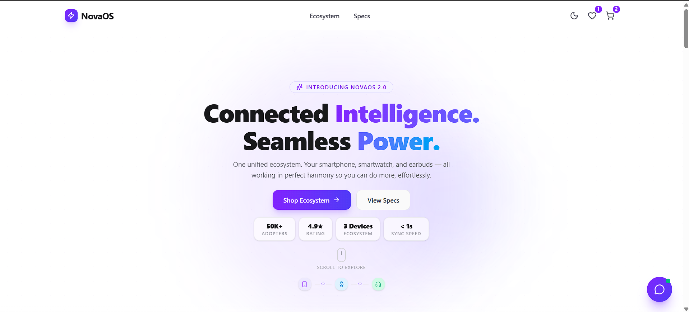
- Section đầu tiên gộp Hero và Scrollytelling thành một trải nghiệm cuộn liên mạch
- 4 "pages" trong 350vh: Hero → Smartphone → Watch → Earbuds
- `AnimatePresence mode="wait"` đảm bảo không chồng nội dung
- **Scroll Animation & Parallax (Điểm cộng):** 
  - File chính: `components/HeroScrollytelling.tsx` (Hook `useScroll`, `useTransform` cho trải nghiệm Scrollytelling)
  - File phụ: `components/FeaturesSection.tsx` (Hiệu ứng Parallax thẻ tính năng bay ở các tốc độ khác nhau)

### 🛒 E-commerce Mini
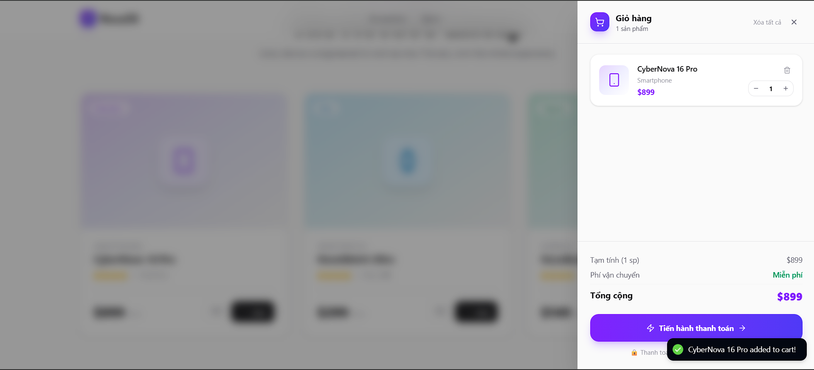
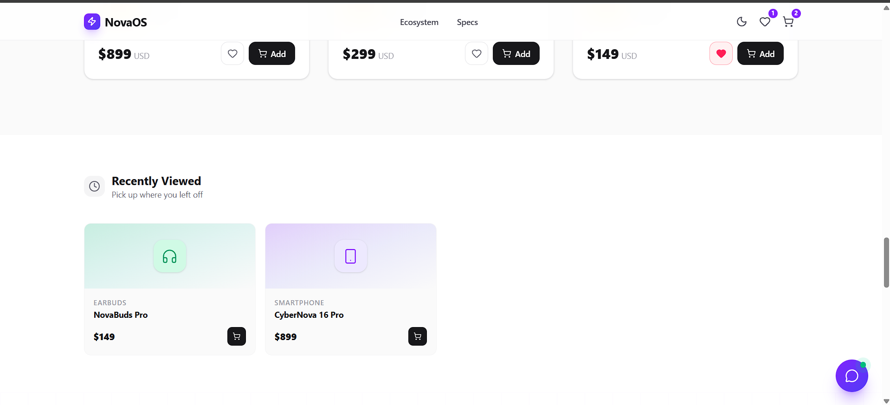
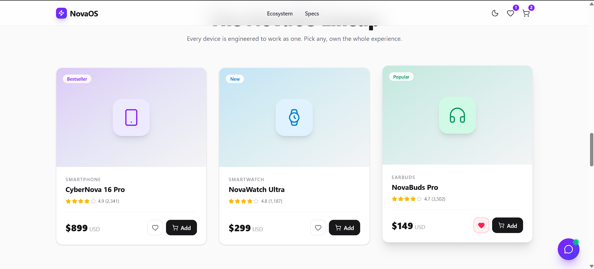
- **Giỏ hàng** — CartDrawer slide-in từ phải, tăng/giảm số lượng, xoá sản phẩm
- **Yêu thích** — toggle heart, lưu persistent qua Zustand
- **Đã xem** — tự động ghi lại khi click vào sản phẩm, hiển thị trong `RecentlyViewed`

### 🤖 AI Chatbot (Nova AI)
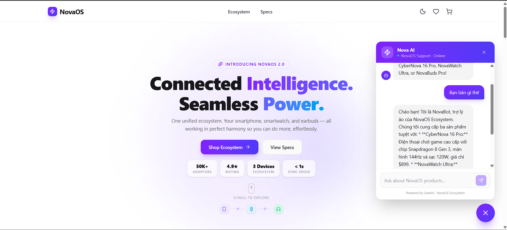
- Powered by Google Gemini với 3-model fallback chain
- System prompt chuyên biệt — chỉ tư vấn sản phẩm NovaOS
- Typing indicator, error handling, auto-scroll


---
## 🌐 Demo & Liên kết

| | Link |
|---|---|
| 🔗 **Live Demo** | [https://nova-ecosystem-7gqbtpd7f-luongtan204s-projects.vercel.app](https://nova-ecosystem-7gqbtpd7f-luongtan204s-projects.vercel.app)
| 📦 **GitHub Repo** | [https://github.com/luongtan204/nova-ecosystem](https://github.com/luongtan204/nova-ecosystem) |
| 📊 **PageSpeed Score** | > 85/100 (Mobile) |

---

## 📋 Yêu cầu đề bài — Checklist

### ✅ Bắt buộc

| # | Yêu cầu | Trạng thái |
|---|---|---|
| 1 | Hero Section | ✅ `HeroScrollytelling` — Scrollytelling + Parallax |
| 2 | Tính năng nổi bật | ✅ `FeaturesSection` — 3 cards với Parallax Y offset |
| 3 | Thông số kỹ thuật | ✅ `ProductGrid` — Price, Rating, Specs |
| 4 | Form đăng ký nhận tin | ✅ `NewsletterFooter` — Lưu Supabase + Toast |
| 5 | Responsive (Desktop & Mobile) | ✅ Tailwind breakpoints |
| 6 | SEO (Title, Description, Open Graph) | ✅ Next.js Metadata API — `layout.tsx` |
| 7 | PageSpeed ≥ 85/100 (Mobile) | ✅ _[Xem ảnh chụp bên dưới]_ |
| 8 | Deploy lên Cloud (Vercel) | ✅ _[Link demo bên trên]_ |
| 9 | Git + GitHub (Public) | ✅ Commit rõ ràng, nhánh `main` |

### 🏆 Điểm cộng

| # | Điểm cộng | Trạng thái | Ghi chú |
|---|---|---|---|
| 1 | Webhook thực tế + Validation | ✅ | `POST /api/subscribe` → Supabase, validate email, duplicate 409 |
| 2 | Thông báo theo dõi hành vi (click/scroll) | ✅ | `AnalyticsTracker` + Toast notification |
| 3 | Dark Mode | ✅ | `ThemeToggle` + `next-themes` |
| 4 | Scroll Animation | ✅ | Framer Motion `useScroll`, `useTransform` |
| 5 | Skeleton Loading | ✅ | `SkeletonCard` với `animate-pulse` |
| 6 | Micro-interactions | ✅ | `whileHover`, `whileTap`, floating icons |
| 7 | Scrollytelling + Parallax | ✅ | `HeroScrollytelling` — 4 stages, AnimatePresence |
| 8 | Lưu yêu thích + Giỏ hàng + Đã xem | ✅ | Zustand + persist middleware + CartDrawer |
| 9 | Chatbot AI (Gemini API) | ✅ | `ChatWidget` → `/api/chat` → Gemini (3 model fallback) |
| 10 | Backend lưu trữ dữ liệu | ✅ | Supabase PostgreSQL — `subscribers` + `user_events` |

---

## 🛠️ Tech Stack

| Layer | Công nghệ |
|---|---|
| **Framework** | Next.js 16 (App Router) |
| **Language** | TypeScript 5 |
| **Styling** | Tailwind CSS v4 |
| **Animation** | Framer Motion |
| **State Management** | Zustand (với persist middleware) |
| **Database** | Supabase (PostgreSQL) |
| **AI Chatbot** | Google Gemini API (`gemini-2.5-flash`) |
| **UI Components** | Lucide React |
| **Notifications** | React Hot Toast |
| **Theme** | next-themes (Dark/Light mode) |
| **Deploy** | Vercel |

---

## 📁 Cấu trúc dự án

```
nova-ecosystem/
├── app/                          # Next.js App Router
│   ├── api/
│   │   ├── chat/route.ts         # POST /api/chat — Gemini AI chatbot
│   │   ├── events/route.ts       # POST /api/events — Analytics tracking
│   │   └── subscribe/route.ts   # POST /api/subscribe — Newsletter
│   ├── globals.css               # Global styles + CSS variables
│   ├── layout.tsx                # Root layout + SEO Metadata
│   ├── page.tsx                  # Trang chủ
│   └── providers.tsx             # Global providers (Theme, Toast, Cart, Analytics)
│
├── components/                   # React components
│   ├── AnalyticsTracker.tsx      # Scroll/click behavior tracking + toast
│   ├── CartDrawer.tsx            # Slide-in cart panel
│   ├── CartDrawerContext.tsx     # Cart drawer context (open/close state)
│   ├── ChatWidget.tsx            # Floating AI chat widget
│   ├── FeaturesSection.tsx       # "Why NovaOS" — Parallax cards
│   ├── Header.tsx                # Navigation + Dark mode toggle + Cart icon
│   ├── HeroScrollytelling.tsx    # Hero + Scrollytelling (4 stages gộp chung)
│   ├── NewsletterFooter.tsx      # Newsletter form + Footer links
│   ├── ProductGrid.tsx           # Product cards + Wishlist + Add to cart
│   ├── RecentlyViewed.tsx        # Sản phẩm đã xem (Zustand)
│   ├── SkeletonCard.tsx          # Skeleton loading placeholder
│   └── ThemeToggle.tsx           # Dark/Light mode button
│
├── lib/
│   ├── analytics.ts              # Client-side event tracking utility
│   └── products.ts               # Product data + icon mapping
│
├── store/
│   └── useStore.ts               # Zustand global store (cart, wishlist, history)
│
├── supabase/
│   └── migrations/
│       └── create_user_events.sql  # SQL migration — user_events table
│
├── utils/
│   └── supabase/                 # Supabase client helpers (server/client/middleware)
│
├── middleware.ts                 # Supabase auth middleware
├── next.config.ts                # Next.js config
├── tailwind.config.ts            # Tailwind config
└── .env.local                    # Environment variables (không commit)
```

---

## ⚙️ Cài đặt & Chạy local

### 1. Clone repo

```bash
git clone https://github.com/<username>/nova-ecosystem.git
cd nova-ecosystem
```

### 2. Cài dependencies

```bash
npm install
```

### 3. Cấu hình biến môi trường

Tạo file `.env.local` ở thư mục gốc:

```env
# Supabase
NEXT_PUBLIC_SUPABASE_URL=https://your-project.supabase.co
NEXT_PUBLIC_SUPABASE_ANON_KEY=your-anon-key

# Google Gemini AI
GEMINI_API_KEY=your-gemini-api-key
```

### 4. Tạo Supabase tables

Chạy file migration trong **Supabase Dashboard → SQL Editor**:

```sql
-- File: supabase/migrations/create_user_events.sql
-- (copy nội dung file và paste vào SQL Editor)
```

Ngoài ra tạo thêm bảng `subscribers`:

```sql
CREATE TABLE IF NOT EXISTS public.subscribers (
  id         uuid        DEFAULT gen_random_uuid() PRIMARY KEY,
  email      text        NOT NULL UNIQUE,
  created_at timestamptz DEFAULT now()
);
ALTER TABLE public.subscribers ENABLE ROW LEVEL SECURITY;
CREATE POLICY "allow_anon_insert" ON public.subscribers
  FOR INSERT TO anon WITH CHECK (true);
```

### 5. Chạy development server

```bash
npm run dev
# → http://localhost:3000
```

---

## 🚀 Deploy lên Vercel

```bash
# Cài Vercel CLI
npm i -g vercel

# Deploy
vercel --prod
```

Hoặc kết nối GitHub repo trực tiếp tại [vercel.com/new](https://vercel.com/new) và thêm các biến môi trường trong Settings → Environment Variables.

---

## 📊 PageSpeed Insights Score

> **Điểm tối ưu hóa hiệu suất trên di động > 85/100**
>
> *Cách thêm ảnh: Thay thế đường dẫn `public/screenshots/pagespeed.png` bằng ảnh thực tế của bạn hoặc URL ảnh.*

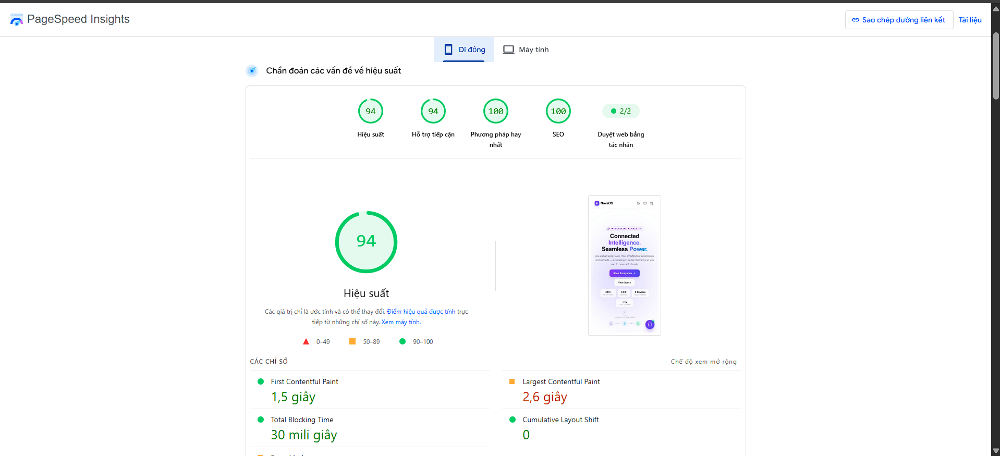

Test tại: https://pagespeed.web.dev/


## 👤 Tác giả

**Lương Minh Tân**  
IT Intern — HELICORP Vòng 2  
_2026_
